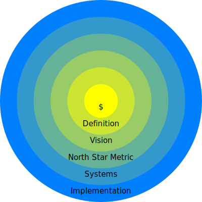

# Project Management

## Development Process Management
* Development Framework
    * [[2023 TGDF] 極度邊緣的開發方式 (黃仕成) ](https://youtu.be/yV0aYkDtqp8)
    * [Slides](https://docs.google.com/presentation/d/1SEad3fuaRG9u78X5sLWwab71ZKbSmEBYQwj0Sv2SYAY/edit)
* Task Management Systems
    * Asana, Monday, .....
    * [GitHub Organization](https://github.com/orgs/)
* Document Management Systems
    * Google Doc, .....
    * Github

## Architecture Design
* Setting Plans and Goals
* Documentation

## One-Page Presentation

* <button class="download" id="proposal-html" data-url="proposal.html">Download Proposal Template</button>
* <button class="download" id="proposal-yml" data-url="proposal.yml">Download Proposal YML</button>
* [Proposal Converter Tool](https://shinra.posetmage.com/GameDesign/Tool/Converter.html)

* <button class="download" id="business-model-html" data-url="business_model.html">Download Business Model Template</button>
* <button class="download" id="business-model-yml" data-url="business_model.yml">Download Business Model YML</button>

## Risk Management
* Risk Identification
* Risk Mitigation
* Monitoring and Review
  * Align Design Pillars

## Financial Management
* Funding Strategy
* Budget Planning
* Cash Flow Management
* Cost, Salary

## Agile Development

* MVP
  * 
* Spiral Model
  * 
* Vertical Slicing
  * 

## Startup
* action more than plan
* deep observe how user use product
* high frequency feedback 
* (modify One-Page Presentation)

