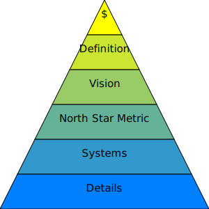

# Project Management

## Development Process Management
* Development Framework
    * [[2023 TGDF] 極度邊緣的開發方式 (黃仕成) ](https://youtu.be/yV0aYkDtqp8)
    * [Slides](https://docs.google.com/presentation/d/1SEad3fuaRG9u78X5sLWwab71ZKbSmEBYQwj0Sv2SYAY/edit)
* Task Management Systems
    * Asana, Monday, .....
    * [GitHub Organization](https://github.com/orgs/)
* Document Management Systems
    * Google Doc, .....
    * Github

## Architecture Design
* Setting Plans and Goals
* Documentation

## One-Page Presentation

* <button class="download" id="proposal-html" data-url="proposal.html">Download Proposal Template</button>
* <button class="download" id="proposal-yml" data-url="proposal.yml">Download Proposal YML</button>
* [Proposal Converter Tool](https://shinra.posetmage.com/GameDesign/Tool/Converter.html)

* <button class="download" id="business-model-html" data-url="business_model.html">Download Business Model Template</button>
* <button class="download" id="business-model-yml" data-url="business_model.yml">Download Business Model YML</button>

## Risk Management
* Risk Identification
* Risk Mitigation
* Monitoring and Review
  * Align Design Pillars

## Financial Management
* Funding Strategy
* Budget Planning
* Cash Flow Management
* Cost, Salary

## Agile Development

* MVP
  * 
  image source from google search websites
* Spiral Model
  * 
  * image source: [Spiral Model For Software Development- A Risky-Driven Model](https://www.bdtask.com/blog/spiral-model-for-software-development)
* Vertical Slicing
  * 
  * image source: [wiki - Vertical_slice](https://en.wikipedia.org/wiki/Vertical_slice)

## Startup
* action more than plan
* deep observe how user use product
* high frequency feedback 
* (modify One-Page Presentation)
* Keep increasing price until compalain but still buying

## Developing Curve

* 
  * 《創新的兩難》 (The Innovator’s Dilemma)

* 

## 季度檢討AAR表

### 核心價值
(確保所有人view一致)
* 這個專案的目標是什麼？
* 該專案是否符合我的業務核心價值觀？
* 這為我的業務增添什麼具體價值？

### 競品
* 還有誰在做這樣的專案，我可以研究和參考？

### 戰略方向
(新的結論，整體未來戰略調整方向)
* 我完成目標了嗎？ 下一季度會怎麼定目標?
* 我從這個專案中學到了什麼？ 
* 我可以採用哪些系統和流程來改進執行？

### 戰術執行
(用來規劃下一步行動細節)
* 哪部分進展順利？ 
* 我會再做類似的事嗎？
* 哪裡做得不好？
* 下次我會採取什麼不同的做法？
* 這是我需要花個人時間做的專案嗎？還是我可以委託團隊中的某個人或外包出去？

### reference
《普通人的財富自由之道》書中範例
1. 這個專案的目標是什麼？	舉辦我的第一次網路研討會，宣傳我新推出的Podcast社群「播客天堂」。
2. 我完成目標了嗎？	是的，我成功舉辦網路研討會，有超過一百五十人參加培訓，十四個人購買播客天堂的會員。
3. 哪部分進展順利？	我的主題演講進行得非常順利，提供了很多價值，覺得都有順利地傳遞出去。
4. 哪裡做得不好？	與會者在即時聊天室提出很多精彩的對話和問題，但我太緊張，只專注在簡報上而忽略了大家的留言。錯過這些互動真的很可惜，因為吸引與會者是建立融洽關係、消除購買障礙的好方法。
5. 我從這個專案中學到了什麼？	我了解到網路研討會將是提供有關Podcast的龐大價值的好方法，也是向大家宣傳加入播客天堂會員的絕佳時機。
6. 該專案是否符合我的業務核心價值觀？	絕對符合。提供免費、有價值且一致的內容是《火力全開的創業家》的目標。
7. 我會再做這樣的事情嗎？	如果大家繼續出席，我每個月至少會舉辦兩次這樣的培訓。
8. 下次我會有什麼不同的做法？	我會希望凱特（稍後會詳細介紹她）能幫忙主持聊天室，並及時告訴我大家提出哪些重要的相關問題，好讓我能回覆。
9. 我可以採用哪些系統和流程來改進執行？	我會改進我們的電子報排序，以便與會者在網路研討會開始之前，就獲得需要的所有資訊。有很多問題本來可以在網路研討會之前就回答，這樣能讓與會者專注於研討會內容。
10. 這是我需要花個人時間做的專案嗎？	還是我可以委託團隊中的某個人或外包出去？
11. 這為我的業務增添什麼具體價值？	這場網路研討讓我可以新的方式向聽眾提供免費價值，增加他們對我們的信任。此外，還讓我成為Podcast領域的專家，同時提升我們創立的優質社群「播客天堂」的曝光率。
12. 還有誰在做這樣的專案，我可以研究和參考？	劉易斯・豪斯（Lewis Howes）和羅素・布蘭森（Russell Brunson）都是網路研討會的大師。我會報名他們的培訓課程，看看我們的研討會還可以進行哪些改善。

